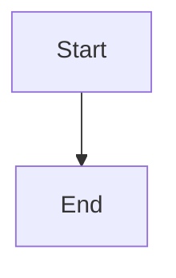

# ContentPanel Components

## Overview

The ContentPanel is a side panel system for viewing and editing detailed row content in the GitBoard Table. It provides a unified, intelligent editor that automatically parses and renders different types of content including Markdown, links, Mermaid diagrams, and images.

## Architecture

The ContentPanel consists of two main components working together:

- **RowDetailPanel**: Main side panel container that slides in from the right
- **UnifiedDescriptionEditor**: Smart editor with edit/render modes (internally uses MermaidViewer for diagram rendering)

---

## Components

### RowDetailPanel

The main side panel component that opens when a user double-clicks on a row number or clicks on a title cell.

#### Props

```typescript
interface RowDetailPanelProps {
  row: Row;                                                    // The row data to display
  isOpen: boolean;                                             // Controls panel visibility
  onClose: () => void;                                         // Callback when panel is closed
  onContentUpdate?: (rowId: string, content: RowContent) => void;  // Callback when content changes
}
```

#### Row Type

```typescript
interface Row {
  id: string;
  values: Record<string, CellValue>;  // Field values (title, status, etc.)
  content?: RowContent;                // Rich content (description, links, diagrams)
}
```

#### RowContent Type

```typescript
interface RowContent {
  description: string;           // Markdown description (can include images, links, code)
  mermaidDiagrams: string[];     // Array of Mermaid diagram definitions
  links: Link[];                 // Array of external links
  documents: Document[];         // Array of document attachments
  attachments: Attachment[];     // Array of file attachments
}
```

#### Usage Example

```tsx
import { RowDetailPanel } from '@/components/ContentPanel';

function MyTable() {
  const [panelOpen, setPanelOpen] = useState(false);
  const [selectedRow, setSelectedRow] = useState<Row | null>(null);

  const handleRowDoubleClick = (row: Row) => {
    setSelectedRow(row);
    setPanelOpen(true);
  };

  const handleContentUpdate = (rowId: string, content: RowContent) => {
    console.log('Content updated for row:', rowId);
    console.log('New content:', content);
    // Update your data store here
  };

  return (
    <>
      {/* Your table component */}
      
      {selectedRow && (
        <RowDetailPanel
          row={selectedRow}
          isOpen={panelOpen}
          onClose={() => setPanelOpen(false)}
          onContentUpdate={handleContentUpdate}
        />
      )}
    </>
  );
}
```

#### Emitted Values

**onContentUpdate Payload:**

```typescript
{
  rowId: string;        // ID of the row being updated
  content: {
    description: string;           // Full markdown content including images
    mermaidDiagrams: string[];     // Extracted from ```mermaid blocks
    links: Link[];                 // Extracted from [text](url) and plain URLs
    documents: Document[];         // Document attachments
    attachments: Attachment[];     // File attachments
  }
}
```

---

### UnifiedDescriptionEditor

The intelligent editor component that powers the content editing experience. It automatically parses pasted content and extracts links, diagrams, and images.

#### Props

```typescript
interface UnifiedDescriptionEditorProps {
  value: string;                    // Markdown content to display/edit
  onChange?: (
    value: string,                  // Updated markdown content
    metadata?: {                    // Automatically extracted metadata
      links: Link[];
      documents: Document[];
      mermaidDiagrams: string[];
    }
  ) => void;
  placeholder?: string;             // Placeholder text for empty editor
}
```

#### Features

1. **Edit Mode**
   - Full markdown editing
   - Paste images directly (Ctrl+V / Cmd+V)
   - Drag & drop images
   - Real-time content parsing
   - Auto-saves changes

2. **Render Mode**
   - Rendered markdown with proper styling
   - Inline image display
   - Clickable links section
   - Mermaid diagram rendering
   - Empty state handling

#### Usage Example

```tsx
import { UnifiedDescriptionEditor } from '@/components/ContentPanel';

function MyEditor() {
  const [content, setContent] = useState('# My Document\n\nStart writing...');

  const handleChange = (
    newValue: string,
    metadata?: { links: Link[]; documents: Document[]; mermaidDiagrams: string[] }
  ) => {
    setContent(newValue);
    
    if (metadata) {
      console.log('Extracted links:', metadata.links);
      console.log('Extracted diagrams:', metadata.mermaidDiagrams);
      // You can store these separately if needed
    }
  };

  return (
    <UnifiedDescriptionEditor
      value={content}
      onChange={handleChange}
      placeholder="Start typing your description..."
    />
  );
}
```

#### Emitted Values

**onChange Payload:**

```typescript
{
  value: string;        // Full markdown text including images (base64)
  metadata?: {
    links: Array<{
      id: string;       // Auto-generated ID
      title: string;    // Link text or URL
      url: string;      // Full URL
    }>;
    mermaidDiagrams: string[];  // Array of diagram definitions
    documents: Document[];       // Empty array (reserved for future use)
  }
}
```

#### Content Parsing

The editor automatically extracts:

**Links:**
- Markdown format: `[text](url)` → `{ title: "text", url: "url" }`
- Plain URLs: `https://example.com` → `{ title: "https://example.com", url: "https://example.com" }`

**Mermaid Diagrams:**
```markdown

```
Extracted as: `["graph TD\n    A[Start] --> B[End]"]`

**Images:**
- Pasted images are converted to base64 and inserted as: ``
- Rendered in preview mode as actual `` tags

---

## Internal Components

### MermaidViewer

This component is used internally by `UnifiedDescriptionEditor` and should not be imported directly. It automatically renders Mermaid diagrams found in ` ```mermaid ` code blocks.

**Note**: You don't need to use this component directly - it's automatically used when you add Mermaid diagrams to your description.

---

## Data Types

### Link Type

```typescript
interface Link {
  id: string;          // Unique identifier
  title: string;       // Display text
  url: string;         // Full URL
  description?: string; // Optional description
}
```

### Document Type

```typescript
interface Document {
  id: string;
  filename: string;
  mime: string;
  size: number;
  url: string;
  thumbnail?: string;
  uploadedAt: string;
}
```

### Attachment Type

```typescript
interface Attachment {
  id: string;
  filename: string;
  mime: string;
  size: number;
  url: string;
  uploadedAt: string;
}
```

---

## Complete Integration Example

```tsx
import React, { useState } from 'react';
import { GitBoardTable } from '@/components/GitBoardTable';
import { RowDetailPanel } from '@/components/ContentPanel';
import type { Row, RowContent } from '@/types';

function App() {
  const [rows, setRows] = useState<Row[]>([/* your rows */]);
  const [detailPanelOpen, setDetailPanelOpen] = useState(false);
  const [selectedRow, setSelectedRow] = useState<Row | null>(null);

  const handleRowOpen = (rowId: string) => {
    const row = rows.find(r => r.id === rowId);
    if (row) {
      setSelectedRow(row);
      setDetailPanelOpen(true);
    }
  };

  const handleContentUpdate = (rowId: string, content: RowContent) => {
    // Update the row in your data
    setRows(prevRows =>
      prevRows.map(row =>
        row.id === rowId
          ? { ...row, content }
          : row
      )
    );

    // Update the selected row for immediate UI update
    if (selectedRow?.id === rowId) {
      setSelectedRow({ ...selectedRow, content });
    }

    // Optionally sync to backend
    saveToBackend(rowId, content);
  };

  const handlePanelClose = () => {
    setDetailPanelOpen(false);
    setTimeout(() => setSelectedRow(null), 300); // Allow exit animation
  };

  return (
    <>
      <GitBoardTable
        fields={fields}
        rows={rows}
        onRowOpen={handleRowOpen}
        onChange={setRows}
      />

      {selectedRow && (
        <RowDetailPanel
          row={selectedRow}
          isOpen={detailPanelOpen}
          onClose={handlePanelClose}
          onContentUpdate={handleContentUpdate}
        />
      )}
    </>
  );
}
```

---

## Styling & Theming

The ContentPanel automatically adapts to light/dark themes using CSS variables:

- `--gb-bg-default`: Background color
- `--gb-text-primary`: Primary text color
- `--gb-border`: Border color

Images in rendered markdown receive automatic styling:
- Responsive sizing (`max-width: 100%`)
- Rounded corners (`border-radius: 8px`)
- Subtle shadows for depth
- Hover effects for interactivity

---

## Keyboard Shortcuts

- **ESC**: Close the panel
- **Ctrl+V / Cmd+V**: Paste images in edit mode

---

## Best Practices

1. **Always provide onContentUpdate callback** to persist changes
2. **Use the unified editor** instead of separate tabs for better UX
3. **Let the parser extract metadata** - don't manually parse markdown
4. **Handle panel close gracefully** with animation delays
5. **Update both local state and backend** when content changes

---

## Future Enhancements

- Document upload functionality
- Real-time collaboration
- Version history
- Comment threads
- @mentions in descriptions
- Task lists with checkboxes
- Image resizing and editing
- Cloud storage for images (vs base64)
